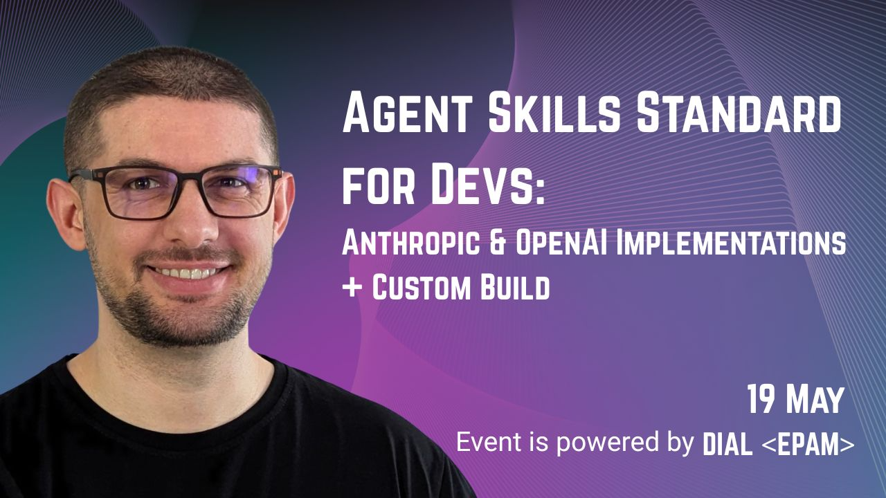

# Custom Agent Skills

A teaching/demo project that shows two ways to work with **Agent Skills**:

1. Through the **official OpenAI and Anthropic Skills APIs** (`api_demo/`).
2. Through a **from-scratch custom implementation** of the skill loading/execution loop wired to the OpenAI Chat
   Completions API (`agent_demo/`).

---

## 1. `api_demo/` — Playing with the official Skills APIs

This folder contains minimal, runnable examples that hit the **vendor-provided Skills APIs** directly. Use it to see how
skill upload, registration, and invocation work end-to-end with each provider.

- **[`api_demo/anthropic_app.py`](api_demo/anthropic_app.py)** — uploads a custom skill via
  `client.beta.skills.create(...)`, runs a multi-turn chat against `claude-sonnet-4-6`, and reuses the container across
  turns. Requires `ANTHROPIC_API_KEY`.
- **[`api_demo/openai_app.py`](api_demo/openai_app.py)** — zips the skill folder, uploads it via
  `client.skills.create(...)`, and chats against `gpt-5.2` using the Responses API with a `container_auto` environment.
  Requires `OPENAI_API_KEY`.

Both apps look in `api_demo/_skills/<skill-name>/` for the skill bundle to upload, then drop into an interactive `You: `
prompt loop (type `exit` to quit).

### Postman alternative

If you'd rather poke at the raw HTTP endpoints, **[`api_demo/_postman/`](api_demo/_postman/)** has everything you need:

- **[`POSTMAN_CURLS.md`](api_demo/_postman/POSTMAN_CURLS.md)** — step-by-step cURL/Postman walkthrough for both OpenAI
  and Anthropic Skills APIs (list, upload, invoke, delete).
- **[`Skills webinar.postman_collection.json`](api_demo/_postman/Skills%20webinar.postman_collection.json)** —
  importable Postman collection with every request pre-configured.
- **[`calculator.zip`](api_demo/_postman/calculator.zip)** — the example skill bundle used in the upload requests.

Set `OPENAI_API_KEY` and `ANTHROPIC_API_KEY` as Postman environment variables and you're ready to go.

---

## 2. `agent_demo/` — Custom skill implementation

`agent_demo/` is a **from-scratch reimplementation** of Anthropic-style skills on top of the OpenAI Chat Completions
API. It shows what the providers' Skills features actually do under the hood:

- Skills live in `agent_demo/_skills/<skill-name>/` as a `SKILL.md` (YAML frontmatter + Markdown runbook) plus optional
  `scripts/` and `references/`.
- Only skill **metadata** is injected into the system prompt (as an `<available_skills>` XML block) — bodies are
  lazy-loaded.
- The agent decides when to activate a skill and pulls its files on demand via a `read_skill` tool.
- Scripts execute inside a **network-isolated Docker container** (`--network=none`, dropped caps, read-only FS,
  memory/CPU limits) managed by a `DockerCodeInterpreterTool`. Per-session containers preserve kernel state across
  calls.

### Running it

You'll need **Docker** running locally (the default image `python:3.11-slim` is auto-pulled on first use) and an
`OPENAI_API_KEY`.

```bash
# 1. Create and activate a virtual environment
python3 -m venv .venv
source .venv/bin/activate          # on Windows: .venv\Scripts\activate

# 2. Install dependencies
pip install -r requirements.txt

# 3. Export your API key
export OPENAI_API_KEY=sk-proj-...

# 4. Run the app
python -m agent_demo.app
```

You'll get an interactive `➡️:` prompt. Try something like *"convert 5 miles to kilometers"* to trigger the bundled
`unit-converter` skill — the agent will read the SKILL.md, load the script, spin up a sandboxed container, and run it.
Type `exit` to quit.