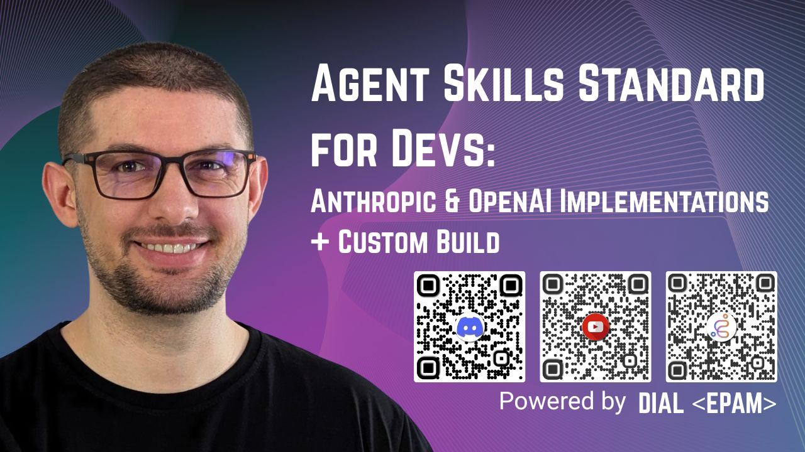

# Custom Agent Skills

A teaching/demo project that shows two ways to work with **Agent Skills**:

1. Through the **official OpenAI and Anthropic Skills APIs** (`api_demo/`).
2. Through a **from-scratch custom implementation** of the skill loading/execution loop wired to the OpenAI Chat
   Completions API (`agent_demo/`).

---

## 1. `api_demo/` — Playing with the official Skills APIs

This folder contains minimal, runnable examples that hit the **vendor-provided Skills APIs** directly. Use it to see how
skill upload, registration, and invocation work end-to-end with each provider.

- **[`api_demo/anthropic_app.py`](api_demo/anthropic_app.py)** — uploads a custom skill via
  `client.beta.skills.create(...)`, runs a multi-turn chat against `claude-sonnet-4-6`, and reuses the container across
  turns. Requires `ANTHROPIC_API_KEY`.
- **[`api_demo/openai_app.py`](api_demo/openai_app.py)** — zips the skill folder, uploads it via
  `client.skills.create(...)`, and chats against `gpt-5.2` using the Responses API with a `container_auto` environment.
  Requires `OPENAI_API_KEY`.

Both apps look in `api_demo/_skills/<skill-name>/` for the skill bundle to upload, then drop into an interactive `You: `
prompt loop (type `exit` to quit).

### Postman alternative

If you'd rather poke at the raw HTTP endpoints, **[`api_demo/_postman/`](api_demo/_postman/)** has everything you need:

- **[`POSTMAN_CURLS.md`](api_demo/_postman/POSTMAN_CURLS.md)** — step-by-step cURL/Postman walkthrough for both OpenAI
  and Anthropic Skills APIs (list, upload, invoke, delete).
- **[`Skills webinar.postman_collection.json`](api_demo/_postman/Skills%20webinar.postman_collection.json)** —
  importable Postman collection with every request pre-configured.
- **[`calculator.zip`](api_demo/_postman/calculator.zip)** — the example skill bundle used in the upload requests.

Set `OPENAI_API_KEY` and `ANTHROPIC_API_KEY` as Postman environment variables and you're ready to go.

---

## 2. `agent_demo/` — Custom skill implementation

`agent_demo/` is a **from-scratch reimplementation** of Anthropic-style skills on top of the OpenAI Chat Completions
API. It shows what the providers' Skills features actually do under the hood:

- Skills live in `agent_demo/_skills/<skill-name>/` as a `SKILL.md` (YAML frontmatter + Markdown runbook) plus optional
  `scripts/` and `references/`.
- Only skill **metadata** is injected into the system prompt (as an `<available_skills>` XML block) — bodies are
  lazy-loaded.
- The agent decides when to activate a skill and pulls its files on demand via a `read_skill` tool.
- Scripts execute inside **network-isolated Docker containers** (`--network=none`, dropped caps, read-only FS,
  memory/CPU limits) managed by `DockerCodeInterpreterTool` — one container per skill, pooled for the turn.

#### Container lifecycle & sharing rules

> **Keep this section up to date** whenever container or tool wiring changes.

- **One container per skill, pooled within a turn.** Each skill gets its own container started lazily on first
  `execute_code` call. Containers are kept alive across all tool calls within the same user turn — no restart cost
  when the same skill is called multiple times in one turn, and no cross-skill state contamination.
- **Turn-boundary wipe.** `reset_all()` is called by `app.main` after each assistant reply, destroying all live
  containers. Secrets processed during a turn cannot leak into subsequent turns.
- **Subagents get their own pool.** Container lifetime is bound to the `DockerCodeInterpreterTool` instance
  (`_sessions` dict). A subagent that constructs a new instance starts with an empty pool — no shared state with
  the parent. There is no mechanism to share containers across agent boundaries.
- **Image pinned to digest.** Both `app.py` and `app_claude.py` reference `python@sha256:<digest>` instead of the
  floating `python:3.11-slim` tag, closing supply-chain risk from unexpected image updates. To refresh:
  `docker inspect --format='{{index .RepoDigests 0}}' python:3.11-slim`.
- **Skill name whitelist.** `DockerCodeInterpreterTool` accepts a `known_skills` frozenset at construction
  (populated from loaded skills). Unknown `skill` values in `execute_code` are silently dropped and warned,
  preventing a malicious `SKILL.md` from spoofing another skill's container.

### Running it

You'll need **Docker** running locally (image pinned to `python@sha256:…`, pulled on first use) and either
an `ANTHROPIC_API_KEY` (Claude) or an `OPENAI_API_KEY` (GPT).

#### 1. Start Docker Desktop

Docker Desktop must be running before you launch the app — the agent starts containers on demand but cannot start the
daemon itself.

**macOS / Windows:** Launch Docker Desktop from your Applications folder or Start menu, then wait for the whale icon in
the menu bar / system tray to stop animating.

**Linux:** Start the Docker daemon if it isn't already running:
```bash
sudo systemctl start docker
```

Verify Docker is ready:

**macOS / Linux:**
```bash
docker ps   # should return an empty table, not an error
```

**Windows (PowerShell) — wait until the daemon is up:**
```powershell
while ($true) { docker ps *>$null; if ($LASTEXITCODE -eq 0) { break }; Start-Sleep 1; Write-Host "waiting for Docker..." }
```

> **Tip (Windows):** To have Docker Desktop start automatically with Windows, open Docker Desktop → Settings →
> General → enable *"Start Docker Desktop when you sign in to your computer"*.

#### 2. Install dependencies and run

```bash
# 1. Create and activate a virtual environment
python -m venv .venv
source .venv/bin/activate          # on Windows: .venv\Scripts\activate

# 2. Install dependencies
pip install -r requirements.txt

# 3. Add your API key to a .env file in the project root
echo 'ANTHROPIC_API_KEY=sk-ant-...' > .env   # Claude
# or
echo 'OPENAI_API_KEY=sk-proj-...' > .env     # GPT

# 4. Run the app
python -m agent_demo.app_claude   # Claude (recommended)
python -m agent_demo.app          # GPT
```

You'll get an interactive `➡️:` prompt. Try something like *"convert 5 miles to kilometers"* to trigger the bundled
`unit-converter` skill — the agent will read the SKILL.md, load the script, spin up a sandboxed container, and run it.
Type `exit` to quit.